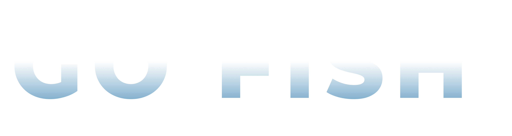

# GoFish-Samples
A repo for public samples of my VR Fishing Game: Go Fish. Using this repo to showcase how development is going and give access to any of the interesting or useful features I develop for the game.

  

## Table of Contents

- [Overview](#overview)
- [Fishing Mechanics](#fishing-mechanics)
    - [Casting Rod](#casting-rod)
    - [Generating Fish](#generating-fish)
    - [Splines](#splines)
    - [Rod Physics Tools](#rod-physics-tools)
- [Visuals](#visuals)
    - [Custom Water Shader](#custom-water-shader)
    - [Custom Skybox Shader](#custom-skybox-shader)
    - [Fish Shaders](#fish-shaders)
- [Models and Assets](#models-and-assets)
    - [Sprite-to-Model Workflow](#sprite-to-model-workflow)
    - [Fish Showcase](#fish-showcase)
    - [Third-Party Asset Alterations](#third-party-asset-alterations)
- [Planned Features](#planned-features)

## Overview

GoFish is an arcade fishing game, currently being developed for VR devices. I'm taking inspiration from some fishing minigames that I have spent _way_ too much time on in other games (_Terraria, Red Dead Redemption 2,_ and _Stardew Valley_ to name a few). All of these minigames have surprisingly deep mechanics, requiring players to correctly combine baits, times of day, weather effects, and different bodies of water to complete their fishing collection. GoFish will implement the same mechanics, combined with a unique visual style, and the enhanced interactivity and immersion of hand-tracked VR. 

https://github.com/SavageOranges/GoFish-Samples/assets/66732618/6519fc2a-d493-4e02-90cb-72291247ab82

GoFish is currently being developed for the Meta Quest 2 and Meta Quest 3.

## Fishing Mechanics

### Casting Rod

The fishing rod casting mechanics are physics based, using a verlet physics-based fishing line with a lure at the end to drive the casting interaction. When the rod reaches a rotation threshold (over the players shoulder) it begins checking the lure velocity. If the lure velocity exceeds a given threshold and exits the rotation threshold, it is considered a cast. The casting mechanic swaps out the verlet physics line and lure, instantiating a new lure and applying the physics forces to it so that the trajectory of the cast is consistent. A new LineRenderer is also generated, replacing the verlet physics implementation with a simple bezier curve generated from the lure to the fishing rod tip. When the newly instantiated lure hits the water, a Y offset is applied and the bezier curve points are updated and lerped, creating the effect of the line settling into the water after it is cast. 

The new lure is a buoyant object, driven by the water shader, creating a realistic bobbing effect.

### Generating Fish

Currently, a fish is generated at random with some random values (length and weight) after the lure has been in the water for a designated amount of time. This mechanic will develop, requiring different baits, times of day, and weather conditions to determine what fish to generate as a caught fish.

I'm using ScriptableObjects to serve as individual fish and available fish to catch databases. The individual fish data is stored in a ScriptableObject for each fish, tracking its name, sprite, and the lower and upper values for any of the randomly generated stats. There is another ScriptableObject that holds all of the available fish to catch, which determines what fish can spawn and where.

### Splines

When a fish is generated and caught, a custom curve is created using the Unity Splines package. The curve is drawn from the lure to a designated point by the player, with a Y offset to create a nice animation effect with the fish arcing out of the water and towards the player. When caught, the fish animates along the Spline curve. When finished, the caught fish transitions to a caught state when it is out of water, currently bobbing and rotating, where the player can interact with it to collect the fish. 

### Rod Physics Tools

I have created some simple helper scripts and visualisers for the rod and casting physics to help with the development of the casting behaviour and physics implementation. The most useful of these at the moment is a script (PhysicsObjectDebugger.cs) that lets me recreate the casting action in Editor, and a trajectory visualiser (TrajectoryVisualiser.cs) to visualise the point where the new lure is instantiated and the arc that it follows when physics are applied.

## Visuals

### Custom Water Shader

For me, part of GoFish's development is to become more familiar with ShaderGraph and creating custom shaders. GoFish has a custom stylised water shader, recreated based on [ameye.dev's excellent tutorial](https://ameye.dev/notes/stylized-water-shader/). This shader implements camera-based depth fade, refraction, horizon reflections, edge foam, waves, and buoyancy for buoyant objects. I've also added some posterize effects to better achieve the visual style I'm going for. 

As the project grows to include different biomes and bodies of water, this shader serves as a great base to create different styles of water to restrict different kinds of fish spawning and being catchable in.

### Custom Skybox Shader

As with the water shader, GoFish has a custom skybox shader, based on [Jannik Boysen's tutorial](https://jannikboysen.de/reaching-for-the-stars/), and will expand to different variations as different biomes and times of day are implemented to the project. Ideally this will be integrated with my existing gradient skybox and real-world time-of-day solution [from my WeatherManager asset](https://github.com/SavageOranges/WeatherManager) to keep the visual style that this shader provides.

### Fish Shaders

The existing fish models have a separate material and vertex shader that creates a swimming effect, which looks pretty effective when the fish are submerged. The shader has controls for how quickly and exaggerated the vertex displacement is, altering how quickly or slowly the fish appear to swim.  

## Models and Assets

### Sprite-to-Model Workflow

The fish assets currently in the project come from [shubibubi's Cozy Fishing pack](https://shubibubi.itch.io/cozy-fishing), which has everything I need to make the fish models, lure models, and a nice collection UI. 

To create the fish models, I've brought the sprite sheet into Blender and subdivided it to match the sprite resolution of each fish. The fish have then been separated into individual meshes, and extruded to create a Minecraft-y 3D pixel-art look, that I think works well with the posterized, chunky style throughout the project.

### Fish Showcase

Currently, there are 40 fish prefabs in the project, with Cozy Fishing having a little over 100 fish that I can implement.

### Third-Party Asset Alterations

As with the shaders, I'm also using GoFish to improve with Blender. Some third-party assets that I've come across and implemented are not suitable initially for VR, or benefit from some additional edits to their meshes. For example, I've improved the pivots on the fishing rod to be much easier to use when working with hand grabs, and I've split the reel and handle away from the initial model, which has allowed me to make the reel fully interactable and rotatable.

## Planned Features

* Reel mechanic to bring caught fish closer before animating along spline and entering the caught state.
* Add [WeatherManager](https://github.com/SavageOranges/WeatherManager) to get player's local time and local weather conditions. Implement visuals for weather and time of day.
* Develop collection UI.
* Develop new biomes and bodies of water.
